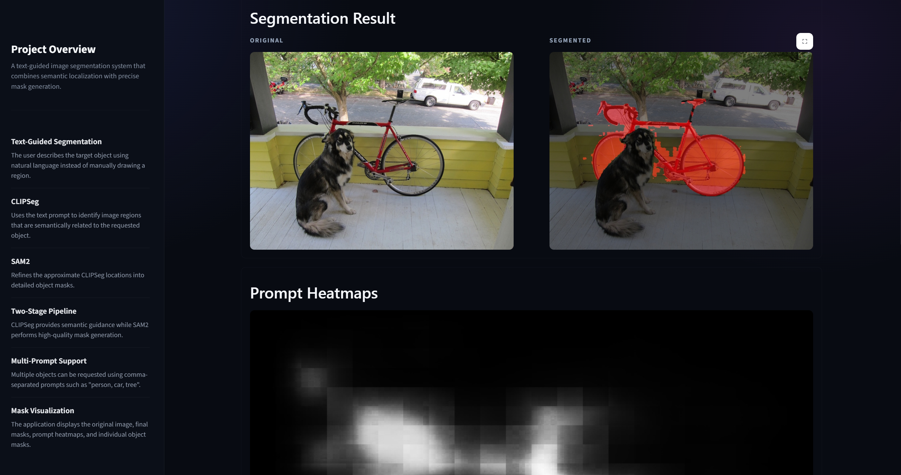
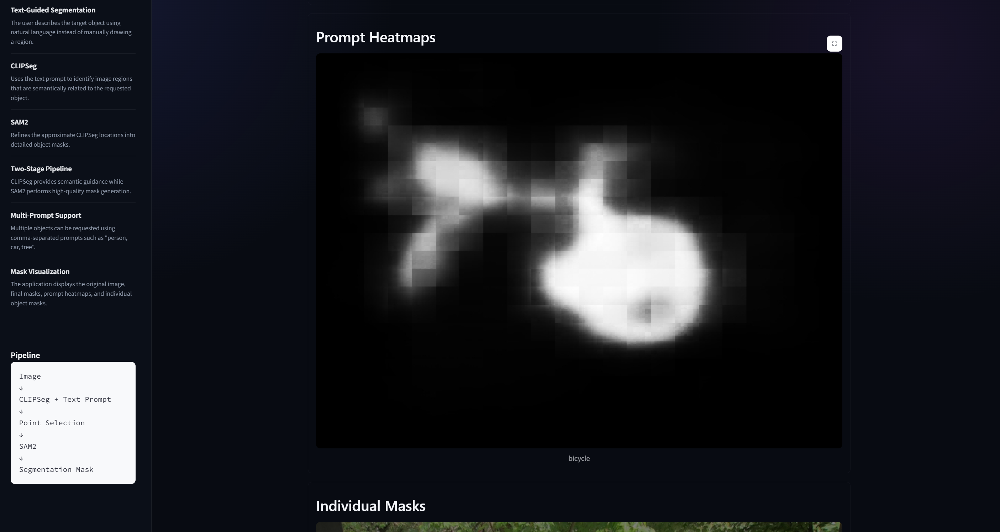

# CLIP-SAM2: Text-Guided Image Segmentation

A text-guided image segmentation system that combines **CLIPSeg** for semantic localization with **SAM2** for precise mask generation.

The system allows a user to upload an image, enter a natural-language prompt such as `dog`, `person`, or `paddle player`, and obtain a segmentation mask without manually drawing points or bounding boxes.

---

## Overview

Traditional segmentation systems often require predefined classes or manual user interaction. This project explores a more intuitive approach:

**Image + Text Prompt → CLIPSeg → Point Selection → SAM2 → Segmentation Mask**

* **CLIPSeg** identifies image regions related to the text prompt and produces a semantic heatmap.
* Relevant points are extracted from the heatmap.
* **SAM2** uses these points to generate a more precise segmentation mask.
* The system supports **single and multiple prompts**.

---

## Technologies Used

| Technology                    | Purpose                                 |
| ----------------------------- | --------------------------------------- |
| **Python**                    | Core implementation                     |
| **PyTorch**                   | Deep learning framework                 |
| **CLIPSeg**                   | Text-guided semantic localization       |
| **SAM2**                      | Precise segmentation mask generation    |
| **Hugging Face Transformers** | CLIPSeg model and processor             |
| **OpenCV**                    | Image processing                        |
| **NumPy**                     | Numerical and array operations          |
| **scikit-image**              | Image and mask processing               |
| **Pillow**                    | Image loading and manipulation          |
| **Streamlit**                 | Interactive segmentation dashboard      |
| **Docker**                    | Reproducible environment and deployment |
| **Git/GitHub**                | Version control                         |
---
## Interactive Dashboard

The project includes a **Streamlit dashboard** for interactive segmentation.


### Dashboard

<p align="center">  </p>

<p align="center">  </p>

<p align="center">  </p>

---

## Segmentation Results

The system was tested on different types of images and objects, including animals, people, and sports scenes.


<p align="center">
  
</p>

<p align="center">
  
</p>

<p align="center">
  
</p>

### Additional Results

<p align="center">
  
  
  
</p>

<p align="center">
  
  
  
</p>


---

## Project Structure

```text
Text-Guided-Image-Segmentation/
│
├── app.py                  # Streamlit dashboard
├── infer.py                # Main segmentation pipeline
├── process_dir.sh          # Batch image processing
├── colors.txt              # Mask visualization colors
├── requirements.txt        # Python dependencies
├── Dockerfile              # Container configuration
│
└── saved_figures/          # Example segmentation results
```

---

## Running the Dashboard

Install the required dependencies:

```bash
pip install -r requirements.txt
```

Start the Streamlit application:

```bash
streamlit run app.py
```

The dashboard will open in your browser.

---

## Running Inference from the Command Line

For a single image:

```bash
python infer.py \
  --image_path /path/to/image.jpg \
  --save_dir /path/to/output \
  --prompts "dog"
```

Multiple objects can be segmented using comma-separated prompts:

```bash
python infer.py \
  --image_path /path/to/image.jpg \
  --save_dir /path/to/output \
  --prompts "dog, person, bicycle"
```

---

## Docker

Build the image:

```bash
docker build -t clipsam2-segmentation .
```

Run inference:

```bash
docker run --rm \
  -v /path/to/input:/workspace/input \
  -v /path/to/output:/workspace/output \
  clipsam2-segmentation \
  python infer.py \
  --image_path /workspace/input/image.jpg \
  --save_dir /workspace/output \
  --prompts "dog, person"
```

---

## Key Contribution

The project demonstrates a practical **text-to-segmentation pipeline** by combining the semantic understanding of CLIPSeg with the high-quality mask generation capabilities of SAM2.

Instead of requiring predefined segmentation classes or manually selected regions, the system allows the target object to be specified directly through **natural-language prompts**.

---

## References

* **CLIPSeg** — Text and image conditioned image segmentation
  https://github.com/timojl/clipseg

* **SAM2** — Segment Anything Model 2
  https://github.com/facebookresearch/sam2

* **Hugging Face Transformers**
  https://huggingface.co/docs/transformers

---

## Author

**Aleena Saleem**

Artificial Intelligence
